# lottery
体育彩票项目,包含体彩所有彩种:足球,篮球,胜负过关,北京单场,大乐透,排列3,排列5,七星彩,任选9,任选14,福彩:双色球,快乐8,福彩3D

本项目为线上体育彩票app，可开启关闭购彩功能，开启关闭出票功能。同时满足体育赛事预测与线下实体店线上售彩等需求。
项目因团队分歧原因停止运营，源码出售中!

## 该项目已经有店铺老板在使用中了,没有任何bug,包括奖金计算,非常精准!

## 项目各个端:
### 客人端
    > 客人端可以,下注投注
### 店主端
    > 店主端可以接单
### 员工端
    > 员工端,是表示如果你店铺很多,你可以给员工一个app端,让他们帮你接单,你自己可以设置接单最高金额等.
### pc后台
### 开奖服务
    > 用于计算奖金,以及中奖金额等

## 下面是展示功能图片

 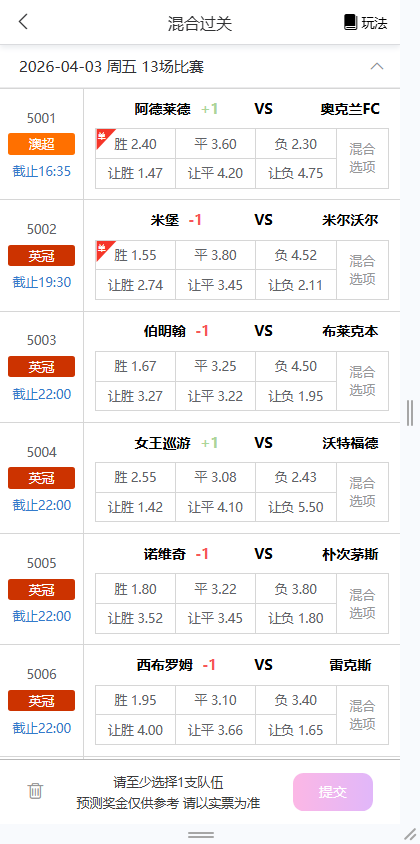 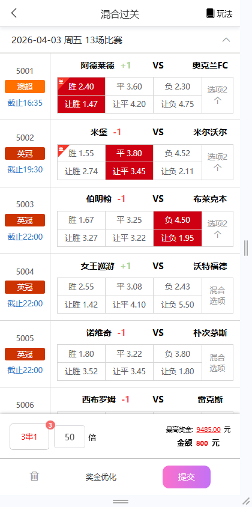 
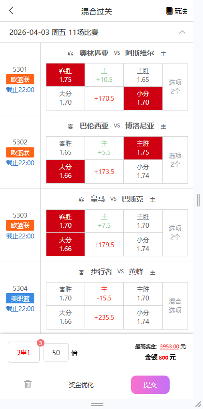 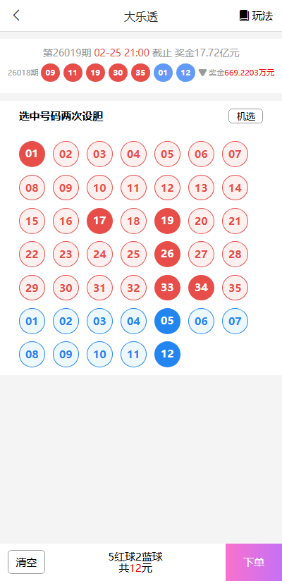 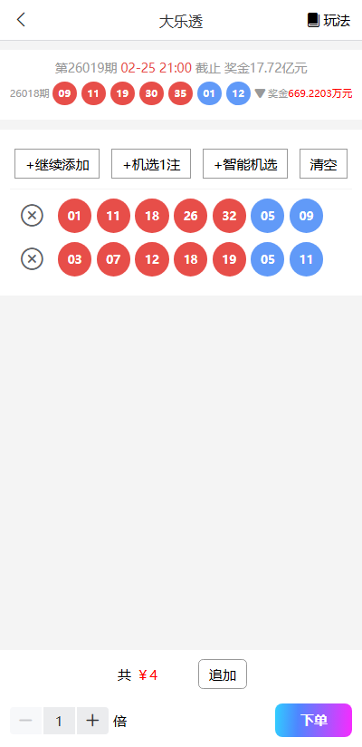 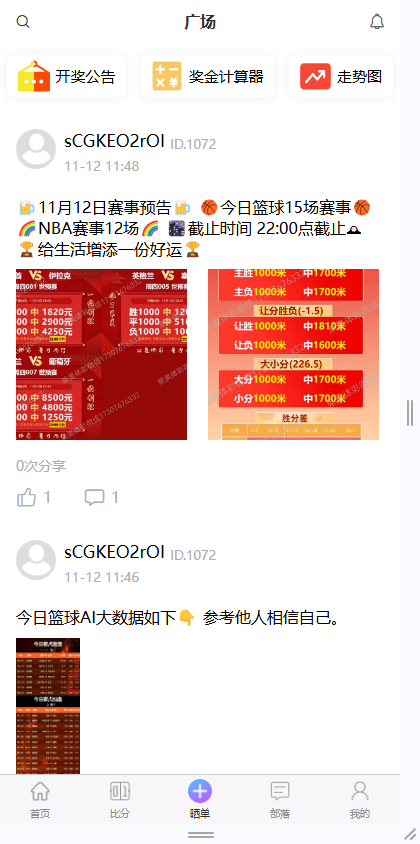
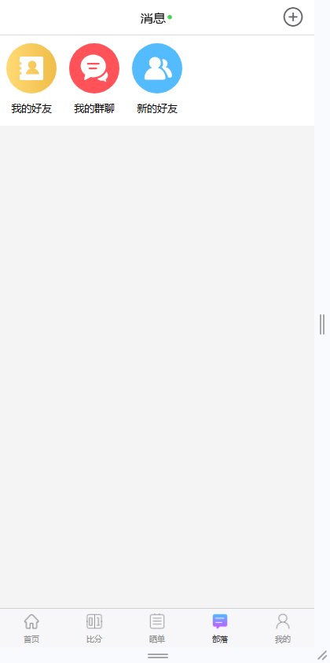 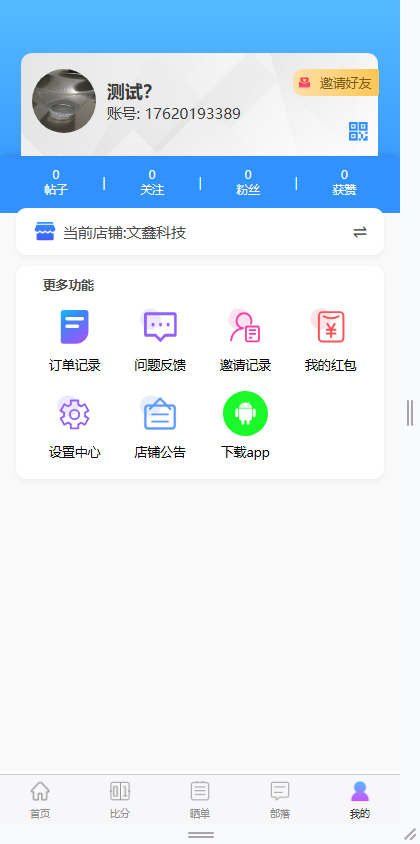 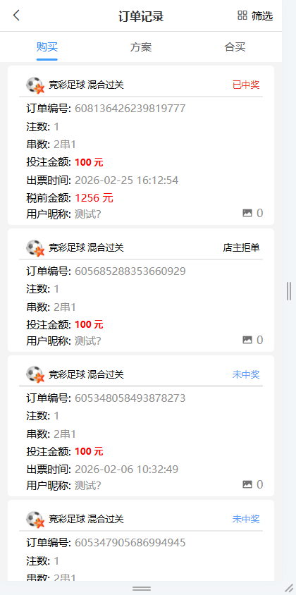 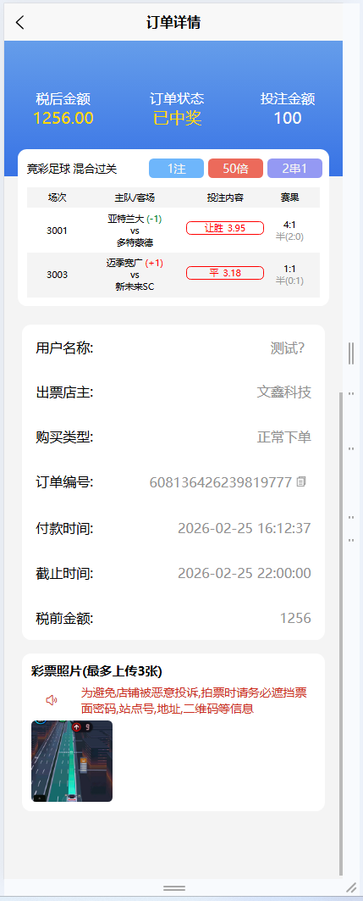 
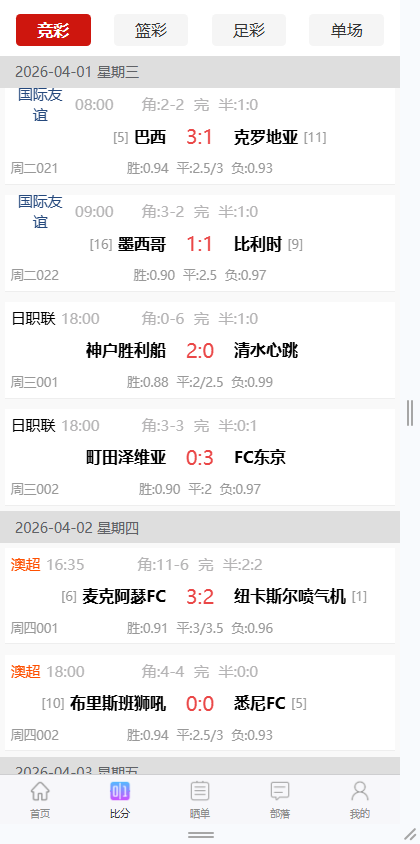 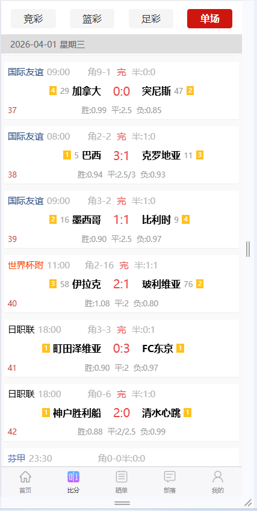

## 下面是店主端跟员工端,就暂时不上图了,有兴趣的老板可以联系我们,
项目可以租赁, 也可以卖整套源码,项目前端采用的是go语言编写的,移动端是uniapp开发的
## 需要请联系telegram：@golang520

